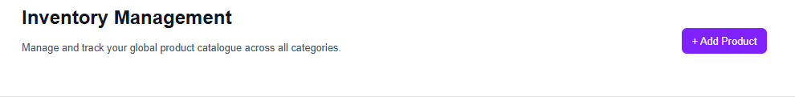
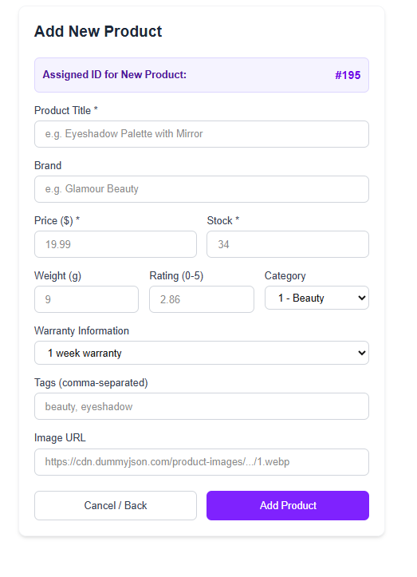
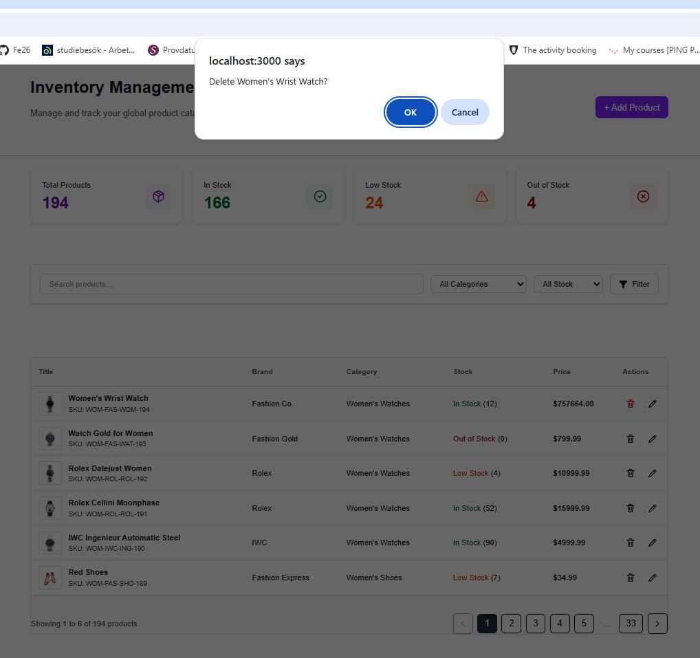

<div align="center">

# Product Inventory Management Dashboard

*A high-performance web application for tracking products, managing stock levels, and automating inventory analytics.*

[](https://nextjs.org/)
[](https://react.dev/)
[](https://www.typescriptlang.org/)
[](https://tailwindcss.com/)
[](https://nodejs.org/)

</div>

This is a [Next.js](https://nextjs.org) project bootstrapped with [`create-next-app`](https://nextjs.org/docs/app/api-reference/cli/create-next-app).

This project uses [json-server](https://github.com/typicode/json-server/tree/v0.17.4) to mock a backend API.

Data in the json for the server is from [dummyjson.com](https://dummyjson.com/docs/products) but modified to fit the needs of this project. Most of the endpoints mirrors those in that documentation.


## Getting Started

First, install the dependencies:

```bash
npm install
# or
yarn install
# or
pnpm install
# or
bun install
```

To start the full development environment (Next.js frontend + JSON Server backend), use:

```bash
npm run dev:full
```

Open [http://localhost:3000](http://localhost:3000) with your browser to see the result.

The JSON server is running on [http://localhost:4000](http://localhost:4000). Here you can see the API endpoints and test them.

You can start editing the page by modifying `app/page.tsx`. The page auto-updates as you edit the file.

## JSON Server Setup

This project uses [json-server](https://github.com/typicode/json-server/tree/v0.17.4) to mock a backend API.

### Configuration

The server configuration files are located in the `server/` directory:

-   `server/products.json`: The database file containing the product data.
-   `server/middleware.js`: Custom middleware for the server.

### Scripts

The following scripts are available in `package.json`:

-   `npm run mock-server`: Starts the json-server on port 4000.
-   `npm run dev:full`: Runs both the Next.js development server and the json-server concurrently.

## API Endpoints

The mock server (running on port 4000) provides the following endpoints:

### Resources
- `GET /products`: Get all products
- `GET /products/:id`: Get a single product by ID
- `GET /categories`: Get all categories
- `GET /categories/:id`: Get a category by ID
- `GET /categories?slug=:slug`: Get a category by slug

### Add Product Button
- `POST /products`: Add a new product
**Required Fields:**
- `title`: String
- `price`: Number
- `description`: String
- `thumbnail`: URL String
- `categoryId`: Number (ID of an existing category)
- `brand`: String

**Auto-generated Fields:**
- `id`: Sequential ID
- `sku`: Generated SKU (format: CAT-BRA-TIT-ID)
- `meta`: Creation and update timestamps

## ➕ Adding New Products

Click the **Add Product** button in the top navigation header to open the item creation form.

<p align="center">
  
</p>

## Form Features & Fields:
<table width="100%">
  <thead>
    <tr>
      <th align="left" width="30%">Feature / Field</th>
      <th align="left" width="70%">Description & Implementation Details</th>
    </tr>
  </thead>
  <tbody>
    <tr>
      <td><b>Required Fields</b></td>
      <td>Mandatory input for <code>Title</code>, <code>Price</code>, and <code>Stock Quantity</code> before submission.</td>
    </tr>
    <tr>
      <td><b>Auto-Generated Identifiers</b></td>
      <td>Unique Product <code>ID</code> and <code>SKU</code> codes are programmatically generated by the server.</td>
    </tr>
    <tr>
      <td><b>Category Selection</b></td>
      <td>Categories are selected and mapped using numerical category codes.</td>
    </tr>
    <tr>
      <td><b>Default Warranty</b></td>
      <td>Automatically applies a default <b>1-week warranty</b> if left blank by the administrator.</td>
    </tr>
    <tr>
      <td><b>SEO & Tagging</b></td>
      <td>Accepts comma-separated tags (e.g., <code>electronics</code>, <code>smart</code>, <code>wireless</code>) to enhance search functionality.</td>
    </tr>
    <tr>
      <td><b>Image Upload</b></td>
      <td>Supports custom image URLs with automated fallback placeholder handling for broken links.</td>
    </tr>
    <tr>
      <td><b>Navigation Options</b></td>
      <td>Includes <b>Cancel / Back</b> controls to safely exit to the dashboard without persisting changes.</td>
    </tr>
    <tr>
      <td><b>Database Sync</b></td>
      <td>Triggers a Next.js Server Action on <b>Save Product</b> to update the backend and instantly invalidate cached views.</td>
    </tr>
  </tbody>
</table>
<p align="center">
  
</p>

#### Auto-Generated Identifiers: Unique Product `ID` and `SKU` are generated programmatically upon submission.
<p align="center">
  
</p>


### Interactive Summary Cards

The inventory dashboard features real-time summary cards at the top of the page to give administrators an instant overview of stock distribution and catalog health.
#### Product Summary Tracked:
<table width="100%">
  <thead>
    <tr>
      <th align="left" width="30%">Metric Card</th>
      <th align="left" width="70%">Description & Threshold Criteria</th>
    </tr>
  </thead>
  <tbody>
    <tr>
      <td><b>Total Products</b></td>
      <td>Live count of all active items currently stored in the inventory database.</td>
    </tr>
    <tr>
      <td><b>In Stock</b></td>
      <td>Items with healthy inventory levels (<code>stock > 10</code>).</td>
    </tr>
    <tr>
      <td><b>Low Stock</b></td>
      <td>Warning threshold for items requiring replenishment (<code>1 <= stock <= 15</code>).</td>
    </tr>
    <tr>
      <td><b>Out of Stock</b></td>
      <td>Critical alert status for items with zero inventory remaining (<code>stock == 0</code>).</td>
    </tr>
  </tbody>
</table>
<p align="center">
  
</p>


#### Key Architecture Highlights:
* **Single-Pass Reduction:** Calculates all four values in a single pass on the server to optimize response times
* **Instant Revalidation:** Purged dynamically using Next.js `revalidateTag("products-summary", "max")` whenever a product is added or deleted.


### 🔍 Product Table, Filtering & Search

The product table is the primary workspace for administrators — refactored into isolated `ProductTable` and `ProductRow` components for maintainability, with all styling migrated from BEM CSS to Tailwind.

<p align="center">
  
</p>

#### Table Features:
* **Search:** Full-text search across product titles.
* **Filtering:** Narrow results by category or stock status — selections are applied via an explicit **Filter** button rather than updating live.
* **Sort Order:** Products are listed newest-first (`_sort=id&_order=desc`); there is currently no user-driven column sorting.
* **Data Ownership:** Products missing a brand display as `"Generic"` instead of `"Unknown brand"`, to avoid implying data that doesn't exist.
### 🗑️ Delete Product Workflow

Administrators can remove products directly from the interactive table view. Clicking the delete action triggers a browser confirmation dialog to prevent accidental deletions.

<p align="center">
  
</p>

#### Implementation Details:
* **User Confirmation:** Displays a browser prompt (`window.confirm`) to verify administrative intent before executing the request.
* **Server Action Execution:** Triggered via a Next.js Server Action (`deleteProduct`) to handle data removal directly on the server
* **Cache Invalidation:** Calls `revalidateTag` for both `"products"` and `"products-summary"` upon successful removal to instantly refresh the product table and update top metric cards.
* **Non-Blocking UI:** Executed within React's `useTransition` hook to provide instant visual feedback (row opacity change) while the network request resolves

<p align="center">
  
</p>

<table width="100%">
  <thead>
    <tr>
      <th width="30%">Action / Layer</th>
      <th width="70%">Technical Behavior</th>
    </tr>
  </thead>
  <tbody>
    <tr>
      <td><b>Trigger</b></td>
      <td>Clicking the <b>Delete</b> icon/button on any product row.</td>
    </tr>
    <tr>
      <td><b>Server Mutation</b></td>
      <td>Executes <code>deleteProductAction(id)</code> via standard HTTP DELETE request.</td>
    </tr>
    <tr>
      <td><b>Cache Invalidation</b></td>
      <td>Calls <code>revalidateTag</code> to instantly purge stale data across table views and summary cards.</td>
    </tr>
    <tr>
      <td><b>State Handling</b></td>
      <td>Wrapped in <code>useTransition</code> for seamless, non-blocking UI updates.</td>
    </tr>
  </tbody>
</table>


### Pagination & Sorting (json-server 0.17.4)
See [json-server documentation](https://github.com/typicode/json-server/tree/v0.17.4) for more information.

#### Pagination
Use `_page` and `_limit` to paginate data:
- `GET /products?_page=1&_limit=10` (First page, 10 items)
- `GET /products?_page=2&_limit=10` (Second page, 10 items)

The response will include the `Link` header with `first`, `prev`, `next`, and `last` links.
Our custom middleware also adds `X-Total-Count` header and wraps the response to include pagination metadata (total, limit, page, pages).

#### Sorting
Use `_sort` and `_order` to sort data:
- `GET /products?_sort=price&_order=asc` (Sort by price, ascending)
- `GET /products?_sort=price&_order=desc` (Sort by price, descending)
- `GET /products?_sort=price,title&_order=desc,asc` (Sort by multiple fields)

#### Filtering
- `GET /products?price_gte=10&price_lte=50` (Price between 10 and 50)
- `GET /products?q=mascara` (Full-text search)

## Learn More

To learn more about Next.js, take a look at the following resources:

- [Next.js Documentation](https://nextjs.org/docs) - learn about Next.js features and API.
- [Learn Next.js](https://nextjs.org/learn) - an interactive Next.js tutorial.
