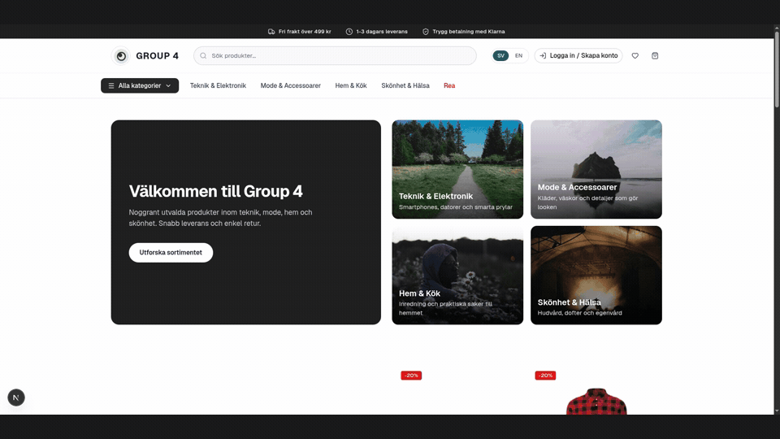

<div align="center">

[](https://nextjs.org/)
[](https://react.dev/)
[](https://www.typescriptlang.org/)
[](https://tailwindcss.com/)
[](https://supabase.com/)
[](https://stripe.com/)


# Webbshoppen – Kundportalen



*A customer-facing e-commerce storefront built with Next.js, Supabase and Stripe — with a product-administration dashboard for staff.*


</div>

This repository contains two apps in one Next.js codebase:

- **The shop** — the customer-facing storefront under `/sv` and `/en`:
  catalog, product pages, cart, Stripe checkout, account and reviews.
  This README focuses on it.
- **The admin dashboard** — product inventory management for staff under
  `/admin`. See [docs/admin-dashboard.md](docs/admin-dashboard.md).

Catalog, order and account data lives in [Supabase](https://supabase.com)
(Postgres + PostgREST + RLS), reached from the server through
`@supabase/ssr`. Checkout uses [Stripe Hosted Checkout](https://docs.stripe.com/payments/checkout).
The seed catalog is based on [dummyjson.com](https://dummyjson.com/docs/products).

## Features

- **Localized storefront** — Swedish (default) and English via
  [`next-intl`](https://next-intl.dev); pages, navigation and metadata are
  translated from the catalogs in `src/messages/`.
- **Catalogue** — responsive product grid with search, category/price/stock
  filters and sorting. All state lives in the URL (`searchParams`), so
  filtered views are bookmarkable and shareable.
- **Product pages** — image gallery with lightbox, reviews with rating
  summary, add-to-cart and wishlist.
- **Cart** — cookie-based and validated with zod; flat-rate shipping that
  becomes free over the threshold (one rule shared by cart, checkout and the
  success page).
- **Checkout** — Stripe Hosted Checkout in SEK with Swedish
  shipping-address collection; the order is recorded only after the paid
  session is verified, and prices are always re-read from Supabase.
- **Account** — Supabase Auth with profile details and saved delivery
  addresses; both are owner-only through RLS.
- **Kundservice** — customer service pages (contact, delivery, returns,
  terms, FAQ).

## Tech Stack

| Layer | Technology |
| :--- | :--- |
| Framework | [Next.js 16](https://nextjs.org) (App Router), [React 19](https://react.dev) |
| Language | [TypeScript](https://www.typescriptlang.org) |
| Styling | [Tailwind CSS 4](https://tailwindcss.com), shadcn/ui-style components |
| i18n | [next-intl](https://next-intl.dev) (`sv` default, `en`) |
| Backend | [Supabase](https://supabase.com) (Postgres, RLS, Auth) via `@supabase/ssr` |
| Payments | [Stripe](https://stripe.com) Hosted Checkout |
| Validation | [zod](https://zod.dev) |
| Toasts | [sonner](https://sonner.emilkowal.ski/) |

## Getting Started

Prerequisites:

- Node.js 20+
- A [Supabase](https://supabase.com) project — see
  [Supabase Setup](docs/supabase-setup.md)
- A [Stripe](https://stripe.com) account in test mode — see
  [Stripe Setup](docs/stripe-setup.md)

1. Install the dependencies:

   ```bash
   npm install
   ```

2. Create `.env.local` with your credentials (see
   [Environment Variables](#environment-variables)).

3. Apply the Supabase migrations — each file in `supabase/migrations/` is
   pasted once into the Supabase SQL editor, in filename order (see
   [Supabase Setup](docs/supabase-setup.md#applying-migrations)).

4. Start the development server:

   ```bash
   npm run dev
   ```

5. Open [http://localhost:3000/sv](http://localhost:3000/sv) (or
   `/en`) with your browser to see the shop. The admin dashboard is at
   [http://localhost:3000/admin](http://localhost:3000/admin).

## Environment Variables

| Variable | Required | Description |
| :--- | :--- | :--- |
| `NEXT_PUBLIC_SUPABASE_URL` | yes | Your Supabase project URL (`https://<project-ref>.supabase.co`). |
| `NEXT_PUBLIC_SUPABASE_PUBLISHABLE_KEY` | yes | Publishable (or anon) key. `NEXT_PUBLIC_SUPABASE_ANON_KEY` is accepted as an alias. |
| `STRIPE_SECRET_KEY` | for checkout | Stripe test secret key. Server-only, read by `src/lib/stripe.ts`. |
| `NEXT_PUBLIC_SITE_URL` | no | Host Stripe redirects back to. Falls back to the request host, which works for `localhost:3000`. |

## Supabase Setup

All data lives in Supabase Postgres, accessed through a data layer
(`src/lib/data/`) that uses one cookie-aware client per request, so RLS
policies always see the caller's session. Catalog reads are public; product
writes require an authenticated user; orders, profiles and addresses are
owner-only.

Details — clients, tables, RLS policies, applying the migrations and seed
data — are in [docs/supabase-setup.md](docs/supabase-setup.md).

## Stripe Setup

Checkout redirects to a Stripe-hosted payment page (no card data touches our
code). The session is built server-side from the cookie cart with prices
re-read from Supabase, collects the Swedish delivery address, and the order is
recorded only after the paid session is verified.

Details — credentials, the checkout flow and shipping — are in
[docs/stripe-setup.md](docs/stripe-setup.md).

## Internationalization

The shop is localized with [next-intl](https://next-intl.dev):

- `src/i18n/routing.ts` — locales (`sv` default, `en`) and the localized
  `Link`/`redirect`/`usePathname`/`useRouter` helpers.
- `src/i18n/request.ts` — resolves the locale per request and loads the
  matching catalog from `src/messages/`.
- `src/messages/sv.json` / `src/messages/en.json` — the translation catalogs.

Shop routes live under the `[locale]` segment (`/sv/products`,
`/en/products`, …). The admin dashboard is not localized and falls back to
the default locale.

## Project Structure

```text
src/
├── app/
│   ├── (shop)/                 # Customer-facing shop
│   │   ├── [locale]/           #   localized routes: landing, products,
│   │   │                       #   products/[id], cart, checkout, account,
│   │   │                       #   auth, reviews, kundservice
│   │   ├── actions/            #   cart, checkout, address, wishlist server actions
│   │   └── auth/               #   sign-out action
│   ├── admin/                  # Staff product administration (not localized)
│   └── layout.tsx              # Root layout: fonts, i18n provider, toaster
├── components/                 # Shared UI: header, footer, catalog, landing, ui
├── i18n/                       # next-intl routing + request config
├── lib/
│   ├── data/                   # Data access layer — single entry point for Supabase
│   ├── supabase/               # Client factories: browser, server, middleware
│   ├── cart.ts                 # Cart rules: limits, shipping cost
│   └── stripe.ts               # Server-only Stripe client
├── messages/                   # Translation catalogs (sv.json, en.json)
└── types/                      # Database row types (src/types/database.ts)
supabase/migrations/            # Schema migrations (applied via the SQL editor)
docs/                           # ADRs and setup guides
wiki/                           # Team standards: coding, version control, file structure
```

## Admin Dashboard

The admin dashboard at `/admin` manages the product catalog: summary cards,
a searchable/filterable/paginated product table, and add/edit/delete
workflows. All writes go through server actions into the same data layer,
gated by RLS. See [docs/admin-dashboard.md](docs/admin-dashboard.md).

## Documentation

- [PRD.md](PRD.md) — product requirements for the customer portal (Fas 2).
- [docs/](docs/) — setup guides and architecture decision records in
  [docs/adr/](docs/adr/).
- [wiki/](wiki/) — team standards: coding, version control, file structure.

## Learn More

To learn more about Next.js, take a look at the following resources:

- [Next.js Documentation](https://nextjs.org/docs) — learn about Next.js features and API.
- [Learn Next.js](https://nextjs.org/learn) — an interactive Next.js tutorial.

## License

This project is licensed under the [MIT License](LICENSE).
