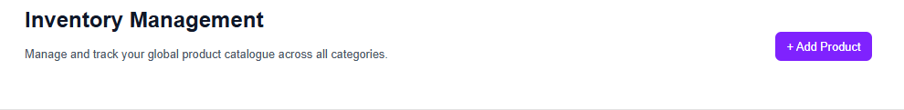
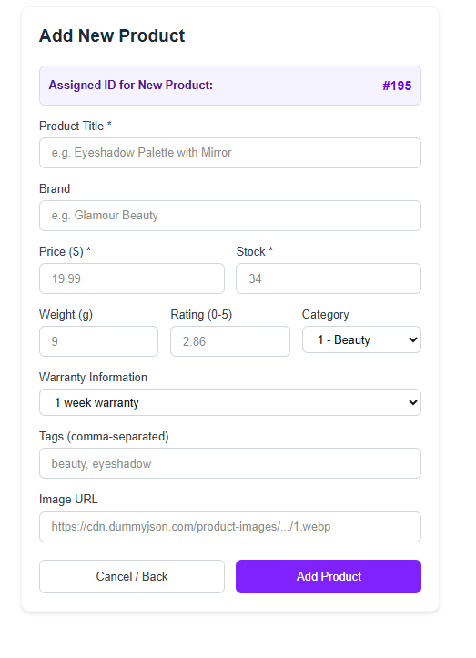
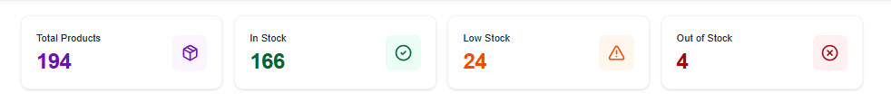
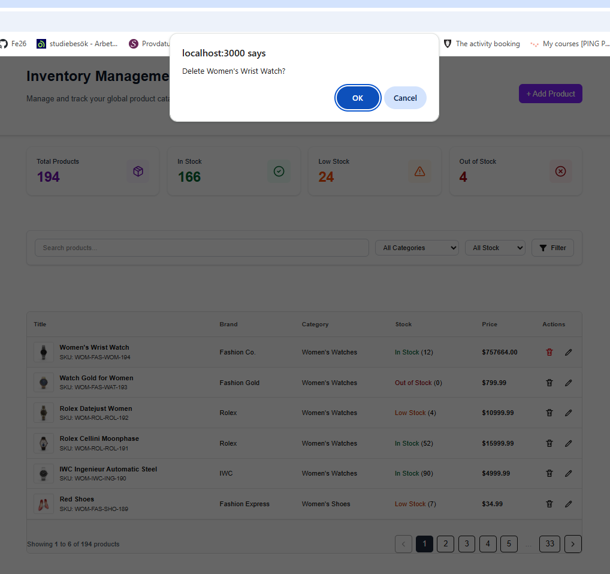

# Admin Dashboard

The admin dashboard at `/admin` is the product-inventory management interface
for staff: summary cards, a searchable/filterable/paginated product table, and
add/edit/delete product workflows. It is not localized (the shop routes are)
and is where catalog writes happen.

All mutations run through Next.js Server Actions in
`src/app/admin/actions/productActions.ts` (and the per-page action files), which
call the data layer in `src/lib/data/` with the cookie-aware Supabase client —
so RLS decides whether the caller may write, and every write is read back
afterwards (an RLS-blocked update or delete returns no error and no rows).

## ➕ Adding New Products

Click the **Add Product** button in the top navigation header to open the item
creation form.

  

### Form Features & Fields

<table width="100%">
  <thead>
    <tr>
      <th align="left" width="30%">Feature / Field</th>
      <th align="left" width="70%">Description & Implementation Details</th>
    </tr>
  </thead>
  <tbody>
    <tr>
      <td><b>Required Fields</b></td>
      <td>Mandatory input for <code>Title</code>, <code>Price</code>, and <code>Stock Quantity</code> before submission. The form is validated server-side with a zod schema (<code>src/app/admin/lib/validation.ts</code>).</td>
    </tr>
    <tr>
      <td><b>Auto-Generated Identifiers</b></td>
      <td>Unique Product <code>ID</code> and <code>SKU</code> codes are programmatically generated by the server.</td>
    </tr>
    <tr>
      <td><b>Category Selection</b></td>
      <td>Categories are selected and mapped using numerical category codes.</td>
    </tr>
    <tr>
      <td><b>Default Warranty</b></td>
      <td>Automatically applies a default <b>1-week warranty</b> if left blank by the administrator.</td>
    </tr>
    <tr>
      <td><b>SEO & Tagging</b></td>
      <td>Accepts comma-separated tags (e.g., <code>electronics</code>, <code>smart</code>, <code>wireless</code>) to enhance search functionality.</td>
    </tr>
    <tr>
      <td><b>Image Upload</b></td>
      <td>Supports custom image URLs with automated fallback placeholder handling for broken links.</td>
    </tr>
    <tr>
      <td><b>Navigation Options</b></td>
      <td>Includes <b>Cancel / Back</b> controls to safely exit to the dashboard without persisting changes.</td>
    </tr>
    <tr>
      <td><b>Database Sync</b></td>
      <td>Triggers a Next.js Server Action on <b>Save Product</b> to update the backend and instantly invalidate cached views.</td>
    </tr>
  </tbody>
</table>

  

#### Auto-Generated Identifiers

Unique Product `ID` and `SKU` are generated programmatically upon submission.

  

### Interactive Summary Cards

The inventory dashboard features real-time summary cards at the top of the page
to give administrators an instant overview of stock distribution and catalog
health.

#### Product Summary Tracked

<table width="100%">
  <thead>
    <tr>
      <th align="left" width="30%">Metric Card</th>
      <th align="left" width="70%">Description & Threshold Criteria</th>
    </tr>
  </thead>
  <tbody>
    <tr>
      <td><b>Total Products</b></td>
      <td>Live count of all active items currently stored in the inventory database.</td>
    </tr>
    <tr>
      <td><b>In Stock</b></td>
      <td>Items with healthy inventory levels (<code>stock > 10</code>).</td>
    </tr>
    <tr>
      <td><b>Low Stock</b></td>
      <td>Warning threshold for items requiring replenishment (<code>1 <= stock <= 15</code>).</td>
    </tr>
    <tr>
      <td><b>Out of Stock</b></td>
      <td>Critical alert status for items with zero inventory remaining (<code>stock == 0</code>).</td>
    </tr>
  </tbody>
</table>

  

#### Key Architecture Highlights

* **Single-Pass Reduction:** Calculates all four values in a single pass on the server to optimize response times.
* **Instant Revalidation:** Purged dynamically with Next.js `revalidatePath("/")` whenever a product is added or deleted.

### 🔍 Product Table, Filtering & Search

The product table is the primary workspace for administrators — refactored into
isolated `ProductTable` and `ProductRow` components for maintainability, with
all styling migrated from BEM CSS to Tailwind.

  

#### Table Features

* **Search:** Case-insensitive match across product title, brand, SKU and description.
* **Filtering:** Narrow results by category or stock status — selections are applied via an explicit **Filter** button rather than updating live.
* **Sort Order:** Products are listed newest-first (`.order("id", { ascending: false })`); there is currently no user-driven column sorting.
* **Data Ownership:** Products missing a brand display as `"Generic"` instead of `"Unknown brand"`, to avoid implying data that doesn't exist.

### 🗑️ Delete Product Workflow

Administrators can remove products directly from the interactive table view.
Clicking the delete action triggers a browser confirmation dialog to prevent
accidental deletions.

  

#### Implementation Details

* **User Confirmation:** Displays a browser prompt (`window.confirm`) to verify administrative intent before executing the request.
* **Server Action Execution:** Triggered via a Next.js Server Action (`deleteProduct`) that deletes the row through the data layer with the session-aware Supabase client, so RLS decides whether the caller may delete it.
* **Verified Write:** The row is read back after the delete; a delete rejected by RLS returns no error, so the data layer throws `WriteRejectedError` and the action reports a failure instead of a false success.
* **Cache Invalidation:** Calls `revalidatePath("/")` and `revalidatePath("/product/<id>")` upon successful removal to instantly refresh the product table and top metric cards.
* **Error Surfacing:** The action returns a state object consumed by `useActionState`; a rejected delete raises a toast and the button is disabled while the request is in flight.

<table width="100%">
  <thead>
    <tr>
      <th width="30%">Action / Layer</th>
      <th width="70%">Technical Behavior</th>
    </tr>
  </thead>
  <tbody>
    <tr>
      <td><b>Trigger</b></td>
      <td>Clicking the <b>Delete</b> icon/button on any product row.</td>
    </tr>
    <tr>
      <td><b>Server Mutation</b></td>
      <td>Form action <code>deleteProduct(state, formData)</code> deletes the row in Supabase through the data layer using the cookie-based client.</td>
    </tr>
    <tr>
      <td><b>Cache Invalidation</b></td>
      <td>Calls <code>revalidatePath</code> to instantly purge stale data across table views and summary cards.</td>
    </tr>
    <tr>
      <td><b>State Handling</b></td>
      <td>Driven by <code>useActionState</code>; the pending state disables the button and an error state is shown as a toast.</td>
    </tr>
  </tbody>
</table>

## Pagination, Sorting & Filtering (Supabase)

Queries live in the data layer (`src/lib/data/products.ts`) and go through the
Supabase client, so they are ordinary PostgREST queries.

### Pagination

`getProducts` uses `.range(from, to)` with `from = (page - 1) * limit`, and
requests the total with `{ count: "exact" }`. The response shape is
`{ products, total, limit, page, pages }`.

### Sorting

`getProducts` orders by `id` descending. Add `.order(column, { ascending })`
calls for other columns.

### Filtering

- Category: `.eq("category_id", categoryId)`
- Stock status: `.gte("stock", 11)` in stock, `.gte("stock", 1).lte("stock", 10)` low, `.eq("stock", 0)` out of stock
- Search: `.or("title.ilike.%term%,brand.ilike.%term%,sku.ilike.%term%,description.ilike.%term%")`
